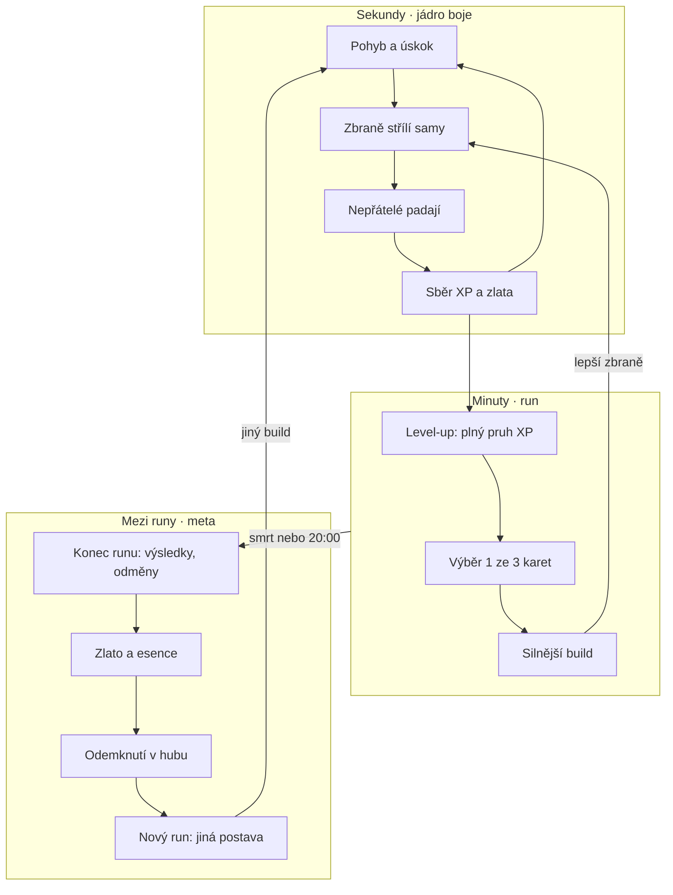
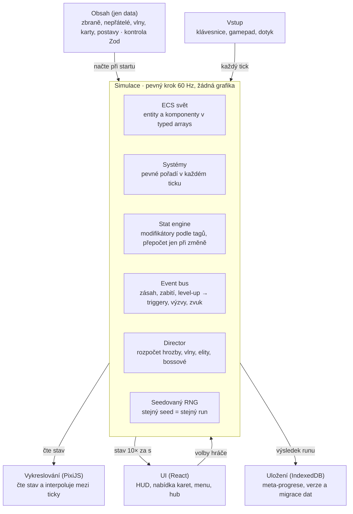

# Survivor hra – design a architektura

*Verze z 1. 10. 2026*

## Vize a pilíře

Jádro zůstává jako ve Vampire Survivors: pohyb, automatické útoky, stovky nepřátel a výběr upgradů. Hloubku přidává pět pilířů.

- **Buildy z tagů.** Každá zbraň a upgrade nese tagy (oheň, projektil, aura…). Pasivy cílí na tagy, takže synergie vznikají samy, ne ručně psanými kombinacemi.
- **Aktivní hraní.** Úskok (dash) s cooldownem a jedna ultimátka nabíjená zabíjením. Pozice a načasování rozhodují víc než ve VS.
- **Kontrola nad náhodou.** Při level-upu reroll, vyřazení, podržení a přeskočení karty. Vzácnosti a prokleté karty s výhodou i cenou.
- **Run s dramaturgií.** 20 minut ve čtyřech fázích, elity s vlastnostmi, minibossové, finální boss a události na mapě.
- **Meta-progrese do šířky.** Mezi runy se hlavně odemyká nový obsah (postavy, zbraně, mapy). Trvalé zesílení je malé a má strop.

Technický cíl: 60 FPS při 1 500 nepřátelích a 3 000 projektilech na běžném notebooku.

## Herní smyčka

Hra má tři smyčky v sobě: boj se točí po sekundách, build roste po minutách a mezi runy se odemyká obsah.



Jeden run trvá 20 minut ve čtyřech fázích. Každá fáze má vlastní vlnovou tabulku, události a vrchol.

| Fáze | Čas | Co se děje |
| --- | --- | --- |
| 1 Rozjezd | 0–5 min | slabé hordy, první 2–3 zbraně, první elita kolem 3. minuty |
| 2 Stavba buildu | 5–10 min | miniboss v 5:00, první obchodník, první evoluce |
| 3 Tlak | 10–15 min | elity se 2–3 vlastnostmi, velké roje, oltáře a obelisky |
| 4 Finále | 15–20 min | miniboss v 15:00, boss ve 20:00, pak volitelně nekonečný režim |

Tempo: na začátku level-up zhruba každých 20–30 s, ke konci asi jednou za minutu. Mezi level-upy má hráč dostat aspoň jedno další rozhodnutí: truhlu, událost nebo obchod.

## Stat systém postavy

Všechna čísla ve hře jdou přes jeden výpočet: základ plus ploché bonusy, pak sečtená procenta, pak násobiče. To je klíč k balancu.

```latex
\text{Výsledek} = (\text{Základ} + \sum \text{Plochý}) \times (1 + \sum \text{Zvýšení}) \times \prod_i (1 + \text{Násobič}_i)
```

Česky: `Výsledek = (Základ + součet plochých) × (1 + součet zvýšení) × (1 + násobič₁) × (1 + násobič₂) …`

- **Zvýšení** (+30 %) se sčítají. Jsou běžná a s každým dalším slábnou.
- **Násobiče** (×1,3) se násobí. Jsou vzácné, dávají je evoluce, relikvie a prokleté karty.

Modifikátor je jeden datový záznam: `{ stat, typ, hodnota, tagy?, zdroj }`. Například „+30 % poškození ohněm“ platí jen pro zbraně s tagem oheň. Hodnoty se přepočítají jen při změně modifikátorů (dirty flag), ne každý snímek.

| Stat | Význam | Výchozí návrh |
| --- | --- | --- |
| Max HP | životy | 100 |
| Regenerace | HP za sekundu | 0 |
| Brnění | snižuje fyzické poškození | 0 |
| Rychlost pohybu | jednotky za sekundu | 200 |
| Poškození | globální násobek | 100 % |
| Plocha | velikost efektů | 100 % |
| Cooldown | rychlost opakování útoků | 100 % |
| Počet projektilů | navíc ke každé zbrani | +0 |
| Trvání | délka efektů | 100 % |
| Šance na krit / krit. poškození | | 5 % / 150 % |
| Dosah sběru | magnet na XP | 60 jednotek |
| Štěstí | vyšší vzácnosti karet | 0 |
| Růst | víc XP | 100 % |
| Odolnosti | oheň, led, blesk, jed | 0 % (max 75 %) |

**Cesta poškození při zásahu:** základ zbraně → modifikátory podle tagů → převody (např. 50 % fyzického na oheň) → hod na krit → brnění a odolnosti cíle → šance na status → spuštění triggerů.

Brnění snižuje zásah podle vzorce snížení = B / (B + 10 × poškození). Malé zásahy tak blokuje dobře, velké hůř.

**Statusy** dávají buildům směr a kombinace:

- **Hoření:** poškození v čase, nestackuje se, obnovuje se.
- **Mráz:** zpomalení, při 3 stackách zmrazení na 1 s.
- **Šok:** cíl dostává +20 % poškození.
- **Jed:** stackuje se bez limitu, slabý jednotlivě.
- **Krvácení:** silnější, když se cíl hýbe.
- **Kombo Roztříštění:** zmražený nepřítel zabitý kritem exploduje a mrazí okolí.

## Zbraně a schopnosti

Každá zbraň = data + jedno z osmi znovupoužitelných chování. Nová zbraň je tak nový záznam v datech, ne nový kód.

**Chování (archetypy):** projektil, orbit, aura, paprsek, řetěz, plošný zásah, past na zemi, vyvolaná bytost.

**Sloty hráče:**

- 6 zbraní a 6 pasivů, jako ve VS.
- Úskok (dash) s cooldownem 3 s a krátkou nezranitelností.
- Ultimátka, která se nabíjí zabíjením a mění se podle postavy.
- Až 3 relikvie mimo sloty (unikátní pravidla, viz Mapa a bossové).

**Úrovně:** zbraň má 8 úrovní, každá s konkrétním bonusem v datech (+1 projektil, +20 % plochy…).

**Evoluce:** zbraň na max úrovni + správný pasiv + truhla z elity = evolvovaná verze s novým chováním.

**Fúze (nové):** dvě zbraně na max se společným tagem se spojí v jednu silnější a uvolní slot.

**Modulátory (nové):** nalezitelné runy vkládané do zbraně (1–2 sloty). Mění pravidla, ne jen čísla:

- +2 projektily, −25 % poškození
- projektily se odrážejí od okraje obrazovky
- 50 % poškození převést na led
- zbraň střílí i dozadu, −15 % rychlosti

**Triggery** spojují build dohromady. Spouštěče: při zásahu, zabití, kritu, úskoku, přijetí poškození, sebrání předmětu, každých N sekund. Příklad: „Při kritu 20 % šance na výboj blesku.“ Pojistka: hloubka řetězení max 2 a vnitřní cooldown 0,2 s, jinak hra spadne do nekonečné smyčky.

| Zbraň | Chování a tagy | Evoluce (s pasivem) |
| --- | --- | --- |
| Dýka | projektil · fyzické | Tisíc čepelí (rychlost útoku) |
| Ohnivá koule | projektil, výbuch · oheň, plocha | Meteor (plocha) |
| Řetězový blesk | řetěz · blesk | Bouřkové srdce (počet projektilů) |
| Ledová aura | aura · led, plocha | Absolutní nula (trvání) |
| Kruhové štíty | orbit · fyzické | Ocelový vír (brnění) |
| Jedová louže | past · jed, plocha | Morová bažina (plocha) |
| Světelný paprsek | paprsek · světlo | Spalující kopí (krit) |
| Duch strážce | vyvolání · stín | Legie (počet projektilů) |

Příklad fúze: Ohnivá koule + Řetězový blesk → Plazmová bouře (výbuchy, které se řetězí).

## Level-up a výběr upgradů

Při level-upu hra zastaví a nabídne 3 karty (4 po odemčení v meta-progresi). Hráč má nástroje, jak náhodu ovlivnit.

**Druhy karet:** nová zbraň, úroveň zbraně, nový pasiv, úroveň pasivu, modulátor (vzácně), prokletá karta (max 1 v nabídce).

| Vzácnost | Síla bonusu (příklad: pasiv poškození) | Základní šance |
| --- | --- | --- |
| Běžná | +8 % | 70 % |
| Vzácná | +12 % | 22 % |
| Epická | +18 % | 7 % |
| Legendární | +25 % | 1 % |

Šance posouvá stat Štěstí.

**Nástroje hráče (počty za run, meta je navyšuje):**

- **Reroll** (3×): nová nabídka.
- **Vyřadit** (2×): karta zmizí z poolu do konce runu.
- **Podržet** (2×): karta zůstane i v příští nabídce.
- **Přeskočit** (bez limitu): malá odměna, 10 zlata nebo 10 % HP.

**Váhy poolu:**

- Karty s tagy, které build už má, mají váhu ×1,5. Build se tak skládá sám, ale ne předvídatelně.
- Pity: 3 nabídky bez nové zbraně a volný slot → další nabídka ji zaručí.
- Plné sloty → v nabídce jsou jen úrovně toho, co hráč má.

**Prokleté karty** dávají velký bonus za trvalou cenu:

- +40 % poškození, −30 % max HP
- +1 projektil všem zbraním, nepřátelé o 20 % rychlejší
- Dvojnásobné XP, žádná regenerace

**Křivka XP:** potřebné XP = 10 × level^1,35. Cíl ladění: level 15 kolem 5. minuty, level 50 kolem 20. minuty. Hodnoty patří do dat, ne do kódu.

## Nepřátelé, AI a director vln

Nepřátele neposílá pevný scénář, ale director s rozpočtem hrozby. Typy nepřátel jsou data se společnými chováními.

| Typ | Chování | Role |
| --- | --- | --- |
| Rojník | jde přímo k hráči | masa |
| Běžec | rychlý, málo HP | nutí k pohybu |
| Tank | pomalý, hodně HP | blokuje cestu |
| Střelec | drží odstup, střílí | trestá stání |
| Nabíječ | zastaví se, ukáže směr, vyrazí | čitelné nebezpečí |
| Rozpadač | po smrti 3 menší | odměňuje plochu |
| Šaman | léčí a posiluje okolí | priorita cíle |
| Kamikadze | u hráče exploduje | trestá blízkost |

**AI pro stovky nepřátel:**

- Žádný pathfinding pro každého. Steering: jdi k hráči + odpuzuj se od sousedů (přes spatial hash).
- Na mapách s překážkami jeden flow field: mřížka vzdáleností od hráče, přepočet 4× za sekundu, všichni z ní jen čtou.
- Nepřítel daleko mimo obrazovku se přesune na opačnou stranu před hráče. Nikdy se tak neztratí.

**Director:**

- Každou sekundu dostane body hrozby podle času runu.
- Utrácí je za skupiny z vlnové tabulky aktuální fáze. Každá skupina má cenu, typ a formaci.
- Formace: kruh obklíčení, zeď z jedné strany, roj, vlna zezadu.
- Adaptace: když hráč zabíjí rychle, rozpočet roste (max +30 %). Když má dlouho málo HP, krátce klesne (max −20 %).
- Strop 1 500 živých nepřátel. Nad ním director místo nových posiluje stávající na elity.

**Elity:** modrá má 1 vlastnost, zlatá 2–3. Elita vždy padá truhla.

Vlastnosti elit: Rychlá, Se štítem (obnovuje se), Upíří, Teleportující, Mrazivá aura, Při smrti exploduje, Vyvolává pomocníky, Odráží 20 % projektilů.

## Mapa, události, elity a bossové

Mapa není jen pozadí: nabízí rozhodnutí s rizikem a odměnou. Každá mapa je biom s vlastními nepřáteli, nástrahou a sadou událostí.

**Generování:** nekonečná mapa z chunků 16×16 dlaždic. Chunk se generuje ze seedu a svých souřadnic, takže stejné místo vypadá vždy stejně a nic se neukládá. Druhý typ mapy: ohraničená aréna s překážkami.

**Události na mapě:**

- **Oltář:** vyber 1 ze 3 obětí (např. −20 % max HP za legendární kartu).
- **Svatyně:** vydrž 5 s v kruhu → dočasný buff na 60 s.
- **Prokletý obelisk:** spustí vlnu elit, odměna legendární truhla.
- **Zamčená truhla:** otevře se po zabití 50 nepřátel v okolí.
- **Obchodník:** každých 5 minut. Za zlato z runu prodává lektvary, rerolly a modulátory.
- **Pohyblivý cíl:** uteč s předmětem do zóny, než tě dostihnou.

**Nástrahy biomů:** lávové pukliny, mlha zkracující výhled, bouře s blesky na náhodných místech.

**Bossové:**

- Souboj uzavře kruhová zeď kolem hráče, hordy se na chvíli stáhnou.
- 3 fáze, každá s novým útokem. Útoky se ukazují na zemi 0,8–1,2 s předem.
- Každý boss je odolný proti jednomu tagu a slabý na jiný. Build tak musí být připravený, nebo pružný.
- Odměna: výběr 1 ze 3 relikvií.

**Relikvie** mění pravidla, ne čísla. Max 3 za run:

- Každý 10. projektil je kritický.
- Úskok za sebou nechá ohnivou stopu.
- Sebrané XP krystaly léčí, ale magnet má −50 % dosahu.
- Zabitý nepřítel se 5% šancí vystřelí tvou náhodnou zbraň.

## Meta-progrese a obtížnost

Mezi runy hráč hlavně odemyká nové možnosti. Trvalé statistiky existují, ale jsou malé, aby nepřebily dovednost a build.

**Dvě měny:**

- **Zlato** (z každého runu): trvalé statistiky, 10 statů × 5 úrovní, např. +2 % poškození za úroveň.
- **Esence** (z bossů a výzev): odemykání postav, zbraní, relikvií, map a slotů navíc (4. karta, reroll).

**Postavy** mají startovní zbraň, pasiv a jednu výjimku z pravidel:

| Postava | Start | Zvláštnost |
| --- | --- | --- |
| Strážce | Kruhové štíty | +20 % brnění, úskok dá štít na 1 s |
| Pyromantka | Ohnivá koule | +15 % poškození ohněm, −10 % HP |
| Lovec | Dýka | +1 projektil, −10 % plochy |

**Odemykání přes výzvy:** „Vyhraj run s ledovým buildem“ odemkne další postavu. Hráč tak má důvod zkoušet nové směry.

**Úrovně žáru (Heat 0–10):** každá přidá jedno pravidlo a zvýší odměny. Příklady: nepřátelé +15 % HP, elity 2× častěji, o 1 reroll méně, boss má 4. fázi.

**Denní výzva:** pevný seed + 2 modifikátory, stejné pro všechny. Díky seedovanému generátoru stojí skoro nic.

**Kodex:** přehled odemčených věcí, jejich efektů a nejlepších časů.

## Technická architektura

Doporučený stack: TypeScript + Vite + PixiJS pro hru, React pro menu a HUD. Logika běží v pevném kroku 60 Hz a o grafice nic neví.



Obsah a vstup vstupují do simulace. Grafika, UI a ukládání jen čtou její stav, UI posílá zpět volby hráče.

**Proč tenhle stack:**

- TypeScript, Vite a React už znáš z PWA projektů a Claude Code v nich pracuje spolehlivě.
- PixiJS vykreslí tisíce spritů přes WebGL v jednom průchodu.
- Běží v prohlížeči, jako PWA na mobilu a přes Tauri jako desktopová appka.
- Alternativy: Godot má lepší editor, ale jeho scény se vibecodingem upravují hůř. Tvůj C# engine míří na 3D a ještě vzniká.

**Klíčová technická rozhodnutí:**

- **Pevný krok:** simulace vždy po 1/60 s, vykreslování interpoluje. Hra se chová stejně na 60 i 144 Hz monitoru.
- **Seedovaný RNG:** veškerá náhoda z jednoho generátoru. Stejný seed a vstupy dají stejný run, takže jde přehrát každý bug.
- **ECS s typed arrays:** entita je číslo, data leží v polích. Tisíce nepřátel bez záseků garbage collectoru.
- **Object pooly:** projektily, nepřátelé, krystaly i čísla zásahů se recyklují. Během boje se nic nealokuje.
- **Spatial hash:** mřížka s buňkou 64 jednotek, přestavba každý tick. Kolize se testují jen se sousedy.
- **Event bus:** systémy se nevolají napřímo. Triggery, výzvy, zvuk i statistiky jen poslouchají události.
- **Data-driven obsah:** vše herní je v `content/` a kontrolují to Zod schémata. Chybný záznam hra odhalí hned při startu.
- **UI odděleně:** React čte stav ze store 10× za sekundu, ne 60×. Volby hráče posílá zpět jako příkazy.
- **Stavy hry:** Načítání → Menu → Hub → Run (Hra / Výběr karet / Pauza / Boss) → Výsledky.
- **Testy bez grafiky:** Vitest spustí celý 20minutový run se simulovaným hráčem. Slouží jako test balancu.

**Pořadí systémů v jednom ticku:**

1. Vstup
2. Pohyb hráče a úskok
3. Director (spawn)
4. AI nepřátel
5. Pohyb všech entit
6. Přestavba spatial hash
7. Zbraně (cooldowny, výstřely)
8. Projektily
9. Kolize
10. Poškození
11. Statusy
12. Smrt a drop
13. Sběr a magnet
14. XP a level-up
15. Triggery z fronty událostí
16. Úklid a návrat do poolů

## Struktura projektu

Složky kopírují vrstvy architektury. Pravidlo: `core`, `ecs`, `systems` a `stats` nesmí importovat nic z `render` ani `ui`.

```
src/
  main.ts               spuštění hry
  core/
    loop.ts             pevný krok 60 Hz + interpolace
    rng.ts              seedovaný generátor
    events.ts           event bus
    pool.ts             object pooly
    spatialHash.ts      mřížka pro kolize
  ecs/
    world.ts            entity a komponenty (typed arrays)
    components.ts
  systems/              jedna logika = jeden soubor
    input.ts  movement.ts  director.ts  enemyAI.ts
    weapons.ts  projectiles.ts  collision.ts  damage.ts
    status.ts  drops.ts  pickup.ts  leveling.ts  triggers.ts
  stats/
    modifiers.ts  calc.ts
  behaviors/            archetypy zbraní
    projectile.ts  orbit.ts  aura.ts  beam.ts
    chain.ts  area.ts  trap.ts  summon.ts
  content/              jen data, žádná logika
    schema.ts           Zod schémata pro kontrolu dat
    weapons/  enemies/  waves/  maps/
    passives.ts  relics.ts  modulators.ts  characters.ts
  render/               PixiJS
    renderer.ts  camera.ts  sprites.ts
    particles.ts  damageNumbers.ts
  ui/                   React
    store.ts  Hud.tsx  LevelUpDraft.tsx
    PauseMenu.tsx  Hub.tsx  Results.tsx
  meta/
    save.ts  progression.ts
  debug/
    DebugPanel.tsx
tests/
  stats.test.ts  draft.test.ts  director.test.ts
  sim20min.test.ts      celý run bez grafiky
CLAUDE.md               pravidla projektu pro Claude Code
PROJECT_STATUS.md       kde jsi skončil
```

`CLAUDE.md` drží pravidla, která Claude Code čte na začátku každé session: oddělení vrstev, obsah jen v `content/`, každá nová mechanika s testem.

## Postup stavby po milnících

Po M3 máš hratelné jádro. Každý milník je 1–3 sessions v Claude Code a končí něčím, co si můžeš zahrát.

- [ ] **M0 Kostra:** Vite + TypeScript + PixiJS, smyčka s pevným krokem, hráč se hýbe (klávesnice i dotykový joystick), kamera, debug panel s FPS.
- [ ] **M1 Hordy:** ECS, pooly, spatial hash, 1 typ nepřítele, kolize, HP a smrt hráče. Test: 2 000 nepřátel při 60 FPS.
- [ ] **M2 Boj:** chování projektil, orbit a aura, cesta poškození, čísla zásahů, XP krystaly, magnet.
- [ ] **M3 Level-up:** stat systém s modifikátory, nabídka 3 karet, reroll, vyřazení, přeskočení, sloty 6 + 6.
- [ ] **M4 Director:** rozpočet hrozby, vlnové tabulky, 5 typů nepřátel, elity s vlastnostmi, truhly, evoluce.
- [ ] **M5 Hloubka:** tagy, statusy, triggery, modulátory, fúze, prokleté karty, úskok a ultimátka.
- [ ] **M6 Run:** čtyři fáze, minibossové, boss s ohlašovanými útoky, události na mapě, obchodník, relikvie.
- [ ] **M7 Meta:** hub mezi runy, ukládání, odemykání, 3 postavy, úrovně žáru, denní výzva.
- [ ] **M8 Leštění:** zvuk, efekty, otřes obrazovky, krátké zastavení při zásahu, balanc přes simulace bez grafiky, build jako PWA a desktop.

**Jak zadávat Claude Code:** jeden milník = jedno zadání s odkazem na tento dokument. Na konci každé session ať aktualizuje `PROJECT_STATUS.md`. Debug panel stav hned v M0: bez něj se mechaniky nedají rozumně zkoušet.

## Otevřená rozhodnutí

Tyhle volby mění architekturu nebo rozsah. Je dobré je uzavřít před M0.

- [ ] **Platforma:** web/PWA + desktop přes Tauri (návrh), nebo nativně v Godotu?
- [ ] **Míření:** jen automatické, nebo i ruční míření druhou páčkou (twin-stick)? Ruční míření mění balanc všech zbraní.
- [ ] **Grafika:** pixel art, neonové vektory, nebo low-poly 2.5D?
- [ ] **Délka runu:** 20 minut, nebo 12–15 minut kvůli mobilu?
- [ ] **Základ:** navázat na NeonSurvivors, nebo začít čistý projekt podle této architektury?
- [ ] **Multiplayer:** návrh je bez něj. Co-op by vyžadoval síťovou synchronizaci a výrazně by rozšířil rozsah.
